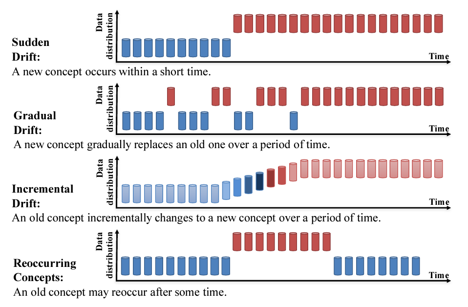

<!-- 
MARP Slide Deck: Managing Model Drift
Created: April 2, 2025
-->

# **Managing Model Drift**
## Concept Drift, Retraining Strategies, and Adaptive Systems

---

# Outline

- Introduction to Model Drift
- Understanding Model Drift Types
- Focus on Concept Drift
- Retraining Strategies
- Adaptive Systems
- Case Studies
- Recommendations & Future Directions

---

# I. Introduction

- ML models deployed in real-world applications face **constant change**
- Models trained on historical data experience **performance decay** over time
- This phenomenon is known as **model drift** (or model decay)
- Common assumptions like i.i.d. data often **break down** in real-world scenarios
- The "**Day 3 Problem**": rapid model failure after deployment

---

# Why Model Drift Matters

- Not just about maintaining metrics
- Essential for **long-term viability** of AI solutions
- Ignoring drift can expose organizations to:
  - Significant risks
  - Financial losses
  - Poor decision-making
- Critical in high-stakes industries:
  - Finance
  - Medicine
  - Defense

---

# II. Understanding Model Drift

> Model drift signifies the deterioration of a machine learning model's ability to make accurate predictions due to changes in the underlying data or relationships between variables.

---

# Types of Model Drift

- **Concept Drift**: Changes in the relationship between input features and target variable
- **Data Drift**: Changes in the distribution of input features
- **Label Drift**: Changes in the distribution of target variables
- **Feature Drift**: Changes in the importance or availability of features
- **Upstream Data Changes**: Changes in data sources or processing methods

---

# Common Causes of Model Drift

- Seasonal variations
- Consumer behavior changes
- Regulatory changes
- Competitive landscape shifts
- Economic conditions
- Technological advancements
- Pandemic or crisis situations

---

# III. Focus on Concept Drift

Concept drift occurs when the statistical relationship between input and output variables changes over time.

---

# Subtypes of Concept Drift

Reference [Drift Concepts](https://medium.com/the-modern-scientist/understanding-data-drift-in-machine-learning-51bf0022ee14)
---

# Detecting Concept Drift

### Performance Monitoring
- Track error rates, accuracy, F1 scores over time
- Establish baseline performance and alert thresholds

### Statistical Tests for Distribution Change
- Kolmogorov-Smirnov test
- Chi-squared test
- Kullback-Leibler divergence
- Jensen-Shannon distance
- Earth Mover's Distance (Wasserstein)

---

# IV. Retraining Strategies

- **Reactive Retraining**: Triggered by performance degradation
- **Scheduled Retraining**: Fixed intervals regardless of performance
- **Hybrid Approach**: Combines scheduled with reactive triggers

---

# Retraining Frequency Considerations

- **Frequent Retraining** (Pros/Cons):
  - ✅ Maintains high model accuracy
  - ❌ Requires significant computational resources
  - ❌ Potential for overfitting to short-term fluctuations

- **Infrequent Retraining** (Pros/Cons):
  - ✅ Resource-efficient
  - ✅ Stable model behavior
  - ❌ Extended periods of suboptimal performance

---

# Data Selection for Retraining

- **Window-Based**: Uses most recent data within a fixed window
  - Pros: Simple implementation
  - Cons: May lose historical patterns

- **Sliding Window**: Continuously updates training data window
  - Pros: Maintains recency bias
  - Cons: Can miss long-term trends

---

# Data Selection for Retraining (cont.)

- **Instance Selection**: Chooses representative samples
  - Pros: Improved efficiency
  - Cons: Selection bias risk

- **Weighted Data**: Assigns higher weights to recent/relevant data
  - Pros: Balances historical and recent trends
  - Cons: Requires careful weight calibration

---

# V. Adaptive Systems for Model Drift

> Adaptive machine learning systems can automatically adjust to changing data patterns without explicit retraining triggers.

---

# Adaptive Learning Techniques

- **Online Learning**: Updates model incrementally with each new data point
  - Example: Stochastic Gradient Descent

- **Ensemble Methods**: Multiple models combined for better adaptation
  - Examples: Dynamic Weighted Majority, Online Bagging

- **Transfer Learning**: Leverages knowledge from related domains
  - Examples: Domain Adaptation, Fine-tuning

---

# Adaptive Learning Techniques (cont.)

- **Incremental Learning Algorithms**:
  - Hoeffding Trees
  - Adaptive Random Forests

- **Concept Drift Detection Algorithms**:
  - ADWIN (ADaptive WINdowing)
  - Page-Hinkley

---

# Applications of Adaptive ML Systems

- **Financial Services**: Fraud detection, credit risk assessment
- **E-commerce**: Recommendation systems, demand forecasting
- **Healthcare**: Patient monitoring, disease progression prediction
- **Climate Science**: Weather forecasting, climate change models
- **Cybersecurity**: Threat detection, anomaly identification

---

# VI. Case Studies in Model Drift Management

Real-world examples provide valuable insights into practical implementation strategies.

---

# Case Study: Financial Fraud Detection

- Fraud patterns constantly evolve to evade detection
- Challenge: Maintaining detection accuracy against novel fraud techniques
- Solution:
  - Hybrid retraining strategy with daily performance monitoring
  - Feature importance tracking to detect concept drift
  - Automatic model version switching based on performance thresholds
- Results: 30% reduction in false positives while maintaining high detection rates

---

# Case Study: E-commerce Recommendations

- Consumer preferences shift based on seasons, trends, economics
- Challenge: Keeping recommendations relevant despite behavior changes
- Solution:
  - Multi-model ensemble with weighted voting
  - Short-term and long-term preference models
  - Online learning with exploration components
- Results: 22% increase in engagement and 15% higher conversion rates

---

# Case Study: Healthcare Patient Monitoring

- Patient condition monitoring in ICU settings
- Challenge: Patient-specific variations and condition evolution
- Solution:
  - Transfer learning approach with personalization layer
  - Continuous adaptation based on vital sign patterns
  - Alert generation for detected drift in patient baselines
- Results: Earlier intervention, reduced false alarms, improved outcomes

---

# VII. Recommendations

### Best Practices for Managing Model Drift

- Continuous monitoring of both data characteristics and model performance
- Select drift detection methods appropriate for your specific use case
- Develop a well-defined retraining strategy considering:
  - Rate and type of drift
  - Available computational resources
  - Business needs and constraints
- Consider adaptive ML techniques for highly dynamic environments
- Establish clear thresholds for triggering drift mitigation

---

# Future Research Directions

- More robust **unsupervised drift detection** methods
- More **efficient retraining techniques** with lower computational costs
- **Explainable drift diagnostics** for better understanding of model degradation
- **Autonomous adaptation systems** that require minimal human intervention
- **Drift-resistant architectures** that maintain performance longer

---

# Thank You

## Questions?

---

# References

1. IBM: "What Is Model Drift?" www.ibm.com
2. C3 AI: "Model Drift Glossary" c3.ai
3. Domino Data Lab: "What is Model Drift in Machine Learning?" domino.ai
4. Striveworks: "What Is AI Model Drift?" striveworks.com
5. Datatron: "What is Concept Drift? Model Drift in Machine Learning" datatron.com
6. DataCamp: "Understanding Data Drift and Model Drift" datacamp.com
7. Coralogix: "What is Model Drift and 5 Ways to Prevent It" coralogix.com
8. Arize: "Model Drift & Machine Learning" arize.com
